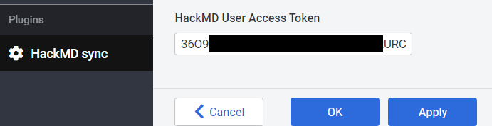
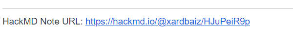

# Joplin -> HackMD
HackMD Joplin Plugin is an *unofficial* plugin to extend the export tools of [Joplin's](https://joplinapp.org/) desktop application.

It allows sharing notes online on the HackMD website

## Features
- Saves HackMD user credentials in secured store
- Uploads note online using HackMD website (one-way share: Joplin :arrow_right: HackMD)
	>  - Content: {temporary} text only _(see 'Roardmap')_
	>  - Access for a new note by default: read - everyone; write - owner only;
- Content of already uploaded note could be updated by re-share

#### RoadMap:
 - Share with pictures
 - Bulk share
 - Continuous syncing  _(one-way periodical sync Joplin :arrow_right: HackMD)_

## Installation
### Automatic _(Joplin v1.6.4 and newer)_
- Open Joplin and navigate to `Tools > Options > Plugins`
- Search for the plugin name and press install
- Restart Joplin to enable the plugin

### Manual
- Download the latest released JPL package (`*.jpl`) from [here](https://github.com/xardbaiz/joplin-plugin-hackmd/releases/)
- Open Joplin and navigate to `Tools > Options > Plugins`
- Press `Install plugin` and select the previously downloaded `jpl` file
- Confirm selection
- Restart Joplin to enable the plugin

### Uninstall
- Open Joplin and navigate to `Tools > Options > Plugins`
- Search for the plugin name and press `Delete` to remove the plugin completely
  - Alternatively you can also disable the plugin by clicking on the toggle button
- Restart Joplin

## Usage
### Register on [HackMD.io](https://hackmd.io)
Then create personal access token ([instruction](https://hackmd.io/@hackmd-api/developer-portal/https%3A%2F%2Fhackmd.io%2F%40hackmd-api%2Fhow-to-issue-an-api-token))

### Fill HackMD plugin settings
Open `Tools > Options > HackMD sync` and fill the `HackMD User Access Token` field

### Share
Select target note and press the `Share on HackMD` button

Wait. If everything is ok - note body will contain link to note on HackMD

## Support
**Best support is contribution** \
You like this plugin as much as I do and it improves your daily work with Joplin?
Then I would be very happy if you buy me a :coffee: via [Revolut](https://revolut.me/xardbaiz) :wink:

## Contributing
Contributions to this plugin are most welcome. Feel free to open a pull request or an issue.
Make sure to use conventional [commit messages](https://github.com/pvdlg/conventional-commit-types) if you're creating a pull request.

### Building the plugin
If you want to build the plugin by your own simply run `npm run dist`.

### Updating the plugin framework
To update the plugin framework, run `npm run update`. 